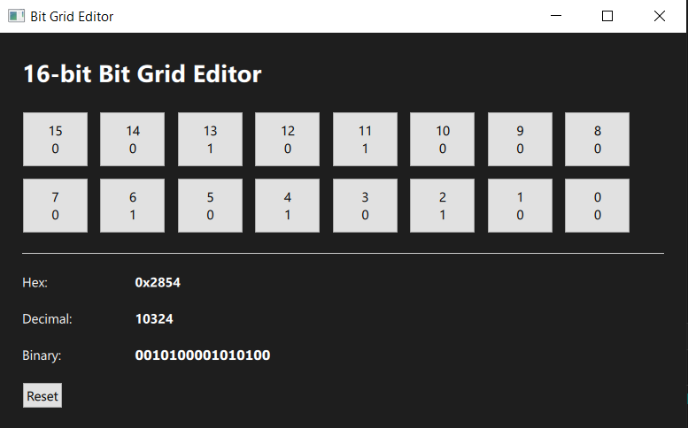

# 🔢 Bit Grid Editor

## 📌 Overview

Bit Grid Editor is a small desktop application built with **C++ + Qt 6 +
QML** for visualizing and editing a 16-bit value.

It provides a simple grid-based interface where each bit can be toggled,
with automatic updates of the numeric representations.

------------------------------------------------------------------------

## 🖼️ UI Preview

------------------------------------------------------------------------

## 🧩 Features

-   16-bit interactive grid (0 / 1 toggle)
-   Real-time updates of:
    -   Hex value
    -   Decimal value
    -   Binary string
-   Reset functionality

------------------------------------------------------------------------

## ⚙️ Core Concept

The application represents a 16-bit number as a grid of bits:

-   Each cell = 1 bit
-   Clicking toggles between 0 and 1
-   The full value is recalculated instantly

### Example

    Binary: 0010100001010100
    Hex:    0x2854
    Decimal: 10324

------------------------------------------------------------------------

## 🛠️ Technologies

-   C++
-   Qt 6 (Qt Quick)
-   QML

