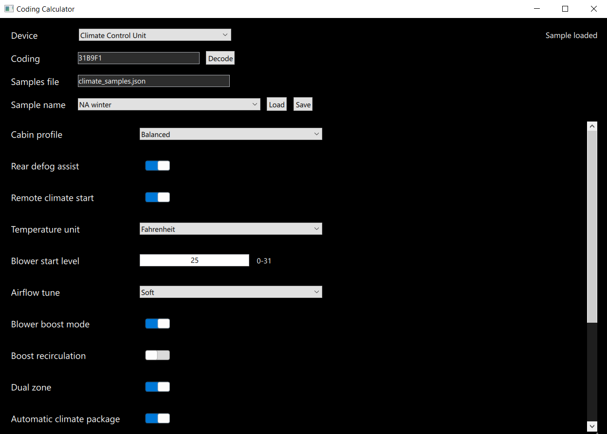

# 🚗 Coding Calculator

## 📌 Overview

Coding Calculator is a desktop application built with **C++ + Qt 6 +
QML** for working with *automotive coding* --- bit-level configurations
used to control electronic modules in vehicles.

------------------------------------------------------------------------

## 🖼️ UI Preview

------------------------------------------------------------------------

## 🧩 Features

-   Select different electronic devices\
-   Input coding as a hex string\
-   Decode and visualize parameters\
-   Modify settings through a clean UI\
-   Load and save configurations (JSON)\
-   Generate updated coding

------------------------------------------------------------------------

## ⚙️ Core Concept

In automotive systems, each electronic module uses a **coding** value
which represents:

-   A sequence of bytes (hex string)
-   Each bit or group of bits has a specific meaning
-   The structure can be nested (multi-level bit fields)

### Example

    BA34 → 1011 1010 0011 0100

### Bit Breakdown

-   bit 8 → Day Running Lights\
-   bit 7 → Comfort Lock\
-   bit 5--6 → Tank size\
-   bit 9--15 → Region / Country (nested structure)

------------------------------------------------------------------------

## 🛠️ Technologies

-   C++\
-   Qt 6\
-   QML\
-   JSON
